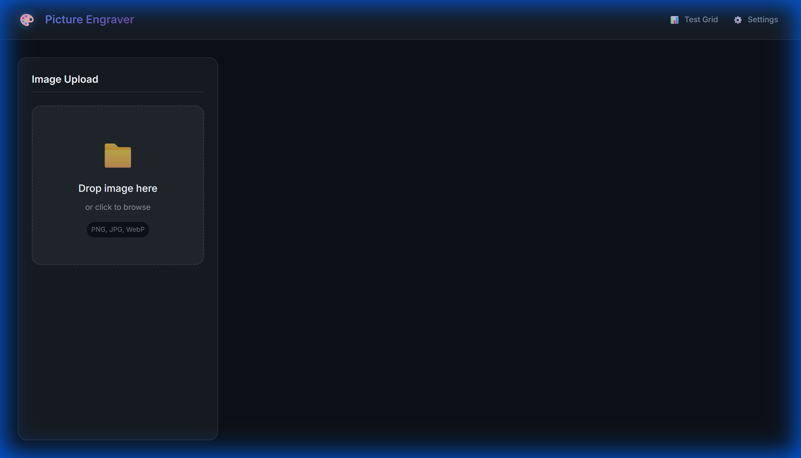
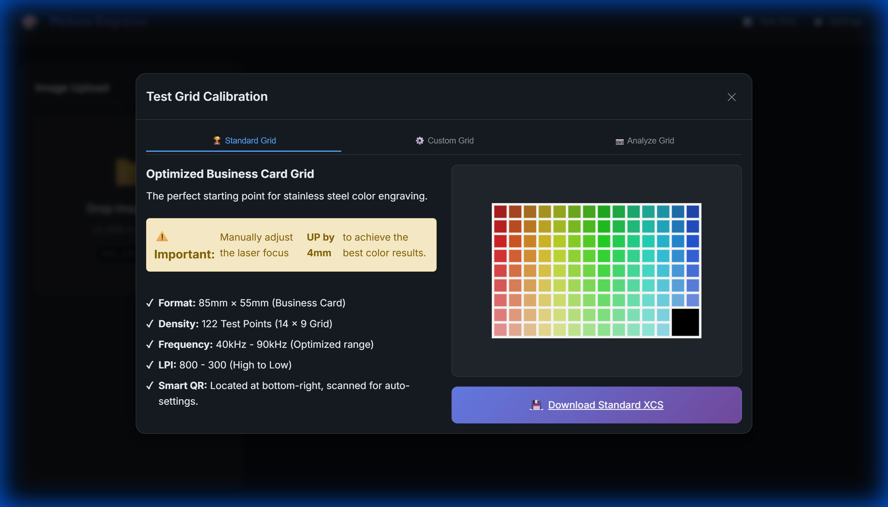
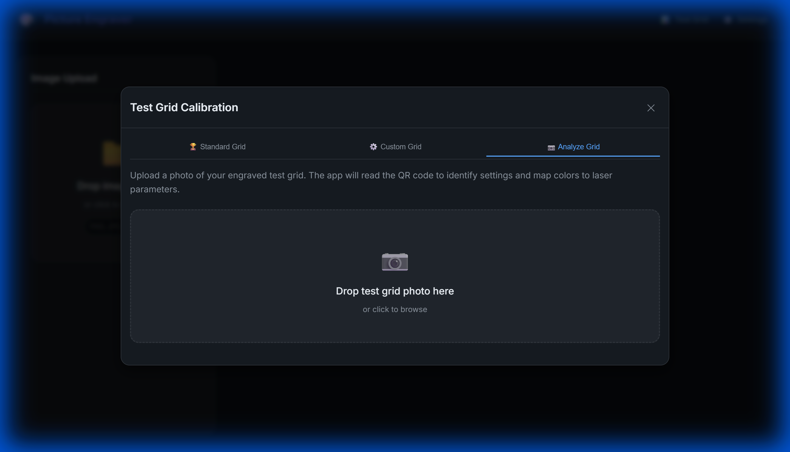

# 🎨 Picture Engraver

Convert images to **XCS laser engraving files** specifically optimized for **stainless steel color engraving**.



## 🌟 Features

- **🚀 Automatic Vectorization**: Converts your bitmap images into clean vectors for laser engraving.
- **🌈 Color Quantization**: Intelligently reduces image colors to a manageable set for laser processing.
- **📊 Calibration Test Grids**: Generate optimized test grids to find the perfect laser parameters for every color.
- **📷 Smart Analyzer**: Upload a photo of your engraved test grid; the app reads the QR code and automatically maps colors to the best laser settings.
- **💾 XCS Export**: Directly export files compatible with xTool Creative Space.

## 🛠️ Calibration Workflow

The key to perfect color engraving is calibration. Picture Engraver streamlines this process:

1. **Generate Grid**: Create a "Standard" or "Custom" calibration grid.
2. **Engrave**: Run the `.xcs` file on your laser (don't forget to focus UP by 4mm!).
3. **Analyze**: Take a photo of the result and upload it to the **Analyzer**.
4. **Apply**: The app now knows exactly which settings produce which colors on your specific machine.

| Standard Grid | Analyzer |
| :---: | :---: |
|  |  |

## 🐳 Docker Deployment

The Docker image supports **both AMD64 (x86) and ARM64** architectures, making it compatible with:
- Standard cloud instances
- Oracle Cloud ARM instances (Ampere A1)
- Raspberry Pi 4/5
- Apple Silicon Macs

Run the application using Docker:

```bash
docker run -d --name picture-engraver --restart always -p 3002:80 pixelplanet5/picture-engraver:latest
```

Or using Docker Compose:

```bash
docker-compose up -d
```

> 📖 **For developers:** See [docs/DOCKER_BUILD.md](docs/DOCKER_BUILD.md) for multi-arch build instructions.

## 🏗️ Local Development

For fast development cycles, we run the app directly on the host without Docker.

1. **Install Dependencies**:
   ```bash
   npm install
   ```

2. **Run Frontend (Vite)**:
   This supports Hot Module Replacement (HMR) for the UI.
   ```bash
   npm run dev
   ```

3. **Run Backend (Node.js)**:
   This provides the API (logging, health) and serves the production build.
   ```bash
   node server.js
   ```

4. **Prepare for Deployment**:
   ```bash
   npm run build
   ```

---
Built for the maker community. 🛠️✨

---
Built for the maker community. 🛠️✨
